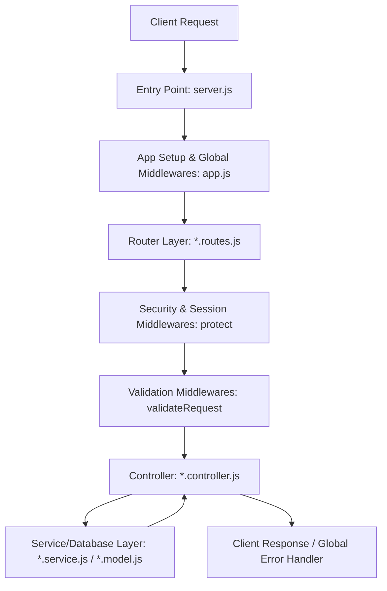

# Backend Analysis & Code Reading Guide

Analyzing a backend codebase can be daunting, but following a structured, step-by-step flow makes it easy to understand any backend. This guide details the methodology of **outside-in tracing** (following the lifecycle of a request) and maps it directly to the Node.js/Express architecture used in this project.

---

## The Request-Response Lifecycle Flow
Before diving into code files, visualize how a client request interacts with the layers of a typical Express backend:



---

## Step-by-Step Backend Analysis Flow

Follow these 7 steps to understand any backend from scratch:

### Step 1: Locate the Entry Point & Configuration
Start at the very beginning of application execution. This helps you understand how the app boots up, connects to services, and configures the runtime environment.

1. **Find the bootstrapper/entry file:** Usually `server.js`, `index.js`, or `app.js` in the root of the server folder.
   - For example, in this project: [server.js](file:///d:/PROJECTS/FULL%20STACK/marketfow-mern-ecommerce/server/server.js).
2. **Identify database & external connections:** Look for database initialization (e.g., `connectDB()`), cache setups (Redis), and event brokers.
3. **Inspect environment configs:** Check `.env` and configuration loaders like [env.js](file:///d:/PROJECTS/FULL%20STACK/marketfow-mern-ecommerce/server/src/config/env.js) to see what credentials and flags govern the app's behavior (e.g., CORS domains, port numbers, token expirations).

---

### Step 2: Analyze the Application Setup & Middleware Stack
Once the server starts, it initializes the main framework container. In Express, this is where the global middleware pipelines are configured.

1. **Inspect App Config:** Open [app.js](file:///d:/PROJECTS/FULL%20STACK/marketfow-mern-ecommerce/server/src/app.js).
2. **Observe global middlewares:** Notice what runs on *every* request:
   - **CORS/Security:** `cors()`, `helmet()`, `mongoSanitize()`
   - **Parsers:** `express.json()`, `express.urlencoded()`
   - **Logging:** Request logers (Morgan, custom loggers)
   - **Rate Limiters:** Prevention of brute-force attacks
3. **Observe static serving & fallback routing:** How are frontend builds served if static?
4. **Identify the route mounts:** Look at where routers are bound (e.g., `/api/v1/users` matches `userRoutes`).

---

### Step 3: Map the Router Layer (The API Entry Gates)
Routers act as a traffic cop. They map incoming HTTP requests (combinations of paths and verbs) to specific handlers.

1. Navigate to the router directory (e.g., [routes/](file:///d:/PROJECTS/FULL%20STACK/marketfow-mern-ecommerce/server/src/routes/)).
2. Pick a specific route file to inspect, e.g., [user.routes.js](file:///d:/PROJECTS/FULL%20STACK/marketfow-mern-ecommerce/server/src/routes/user.routes.js).
3. Identify how routes are structured:
   - What path maps to what controller function?
   - What intermediate functions (middlewares) are chained onto the route?

> [!TIP]
> Mapping out routes first is the fastest way to understand the full capabilities of an API. It provides a clean, searchable index of all endpoints.

---

### Step 4: Trace the Intermediate Middleware Chain
Before a request reaches a controller, it passes through security checkpoints, authentication barriers, and validation rules.

1. **Authentication & Authorization:**
   - Look for guards like `protect` or `requireAuth`. Check if they extract token payload (e.g. JWT) and attach the user instance to `req.user`.
   - Check role-based guards like `authorizeRoles(Roles.ADMIN)`.
2. **Data Validator Middlewares:**
   - Look for validators (e.g., `validateRequest(...)` wrapping a schema like Joi, Yup, or Zod).
   - This ensures malformed data is rejected immediately at the boundary, keeping your controller logic clean.

---

### Step 5: Dive into Controllers (The Coordinators)
Controllers are the logical brain of the request-response lifecycle. They extract input, run validation checks, invoke helpers, and format the output.

When reading a controller function:
1. **Unpack inputs:** Look at what the function extracts from:
   - `req.body` (POST/PUT payloads)
   - `req.params` (Route parameters like `/users/:id`)
   - `req.query` (Query parameters like `?page=1&limit=10`)
   - `req.user` (Authenticated user data set by auth middlewares)
2. **Business logic delegation:** Does the controller execute database operations directly, or does it call a service/utility function?
3. **Trace the response structure:** Look for the final `res.status(...).json(...)` statement. Check if the project uses a wrapper for responses.

---

### Step 6: Review the Data & Model Layer
The models represent how data is modeled, related, and validated at the storage level.

1. Navigate to the database schemas/models folder (e.g., [models/](file:///d:/PROJECTS/FULL%20STACK/marketfow-mern-ecommerce/server/src/models/)).
2. Analyze the schema options:
   - What fields are required?
   - Are there built-in validators, custom validators, or enum lists?
   - Are there relational fields (e.g., `ref: 'User'`)?
3. **Check Mongoose Hooks & Virtuals:** Look for `.pre('save', ...)` hooks (e.g., for hashing passwords) or virtual properties (derived properties).

---

### Step 7: Explore Utilities, Services & Global Handlers
Finally, look at shared modules and error structures to understand how cross-cutting concerns are managed.

1. **Services:** Modules for external integrations (e.g. Stripe, Razorpay, Mailgun).
2. **Utils:** Helper modules (e.g. custom error classes, token generators, file upload formatters).
3. **Global Error Handling Middleware:** Open the final middleware configured in `app.js` (typically `errorHandler.js`). Understand how errors are standardly caught, logged, and formatted before sending back to the user.

---

## 🔍 Concrete Trace Example: Modifying Profile Password
Let's see how a real request flows step-by-step through this backend:

```
Request: PUT /api/v1/users/change-password
Headers: Authorization: Bearer <jwt-token>
Body:    { "oldPassword": "xxx", "newPassword": "yyy" }
```

1. **Server Entrance:** [server.js](file:///d:/PROJECTS/FULL%20STACK/marketfow-mern-ecommerce/server/server.js) starts the Express server which instantiates the [app.js](file:///d:/PROJECTS/FULL%20STACK/marketfow-mern-ecommerce/server/src/app.js) application.
2. **Routing Route Mount:** Inside [app.js](file:///d:/PROJECTS/FULL%20STACK/marketfow-mern-ecommerce/server/src/app.js), the router is mounted under:
   ```javascript
   app.use("/api/v1/users", userRoutes);
   ```
3. **Route Matching:** Inside [user.routes.js](file:///d:/PROJECTS/FULL%20STACK/marketfow-mern-ecommerce/server/src/routes/user.routes.js), the route path `/change-password` matches:
   ```javascript
   router.put(
     "/change-password",
     protect,
     validateRequest(validateChangePassword),
     asyncHandler(changeMyPassword)
   );
   ```
4. **Authentication Check:** The `protect` middleware runs first. It verifies the JWT token, fetches the user from the database, and stores it in `req.user`.
5. **Schema Validation:** Next, `validateRequest(validateChangePassword)` runs. It validates that the request body has both `oldPassword` and `newPassword` conforming to constraints.
6. **Controller Handler:** If validation succeeds, `changeMyPassword` controller runs. It checks if the current password is correct, updates it, and calls `await req.user.save()`.
7. **Model Lifecycle Hook:** In the User Model, a pre-save hook will capture the updated password and hash it before saving to MongoDB.
8. **Client Response:** The controller returns a JSON response with status code `200 OK`.

---

## 💡 Pro Tips for Analysis

* **Use IDE Navigation Utilities:** Hold `Ctrl` (or `Cmd` on Mac) and click on any imported module, class, or function name in Cursor/VS Code. This jumps you directly to its definition.
* **Inspect `package.json` First:** When analyzing any new project, look at `package.json` to understand the main dependencies (e.g. express, mongoose, jsonwebtoken, etc.) and run scripts.
* **Trace Log Outputs:** When running local development servers (e.g., `npm run dev`), trigger APIs via Postman/frontend and trace the request log outputs in the terminal to see what routes are triggered in real-time.
